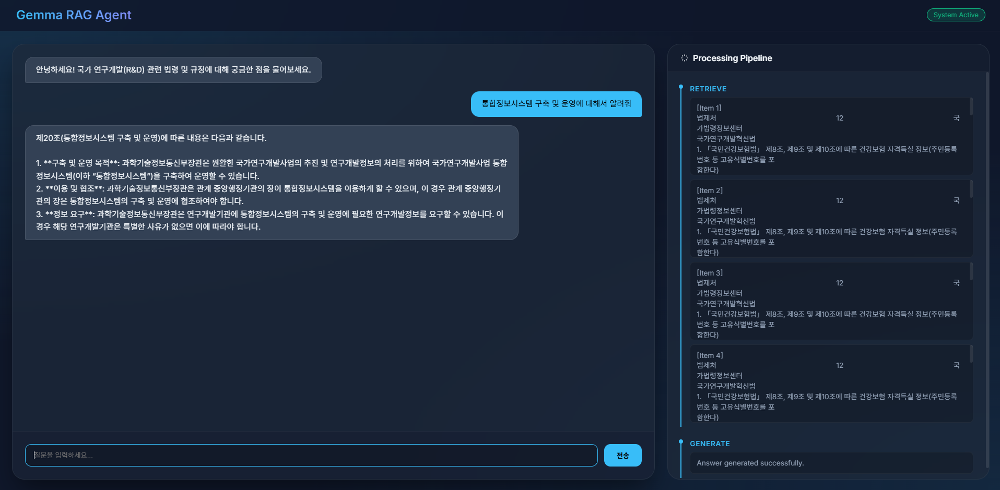
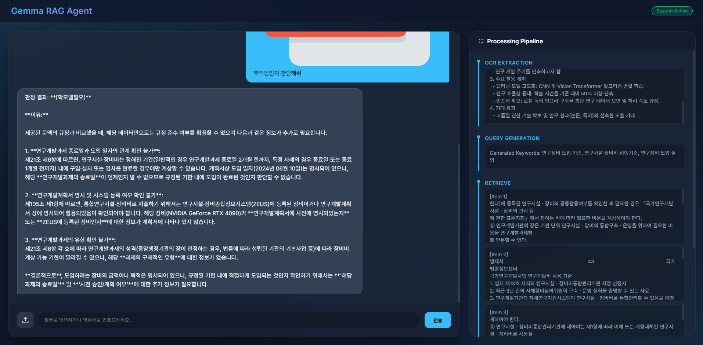

# 🛡️ Solo R&D Auditor: 국가 R&D 전문 AI 감사 시스템

본 프로젝트는 **Gemma** 모델과 **RAG(검색 증강 생성)** 기술을 결합하여, 국가연구개발사업 법령 및 부적정 사례집을 기반으로 영수증과 연구계획서의 적정성을 자동으로 판단해주는 AI 에이전트 시스템입니다.

---

## 🤖 모델 선택 가이드

본 시스템은 하드웨어 환경과 요구되는 분석 수준에 따라 두 가지 모델을 지원합니다.

### 1. Gemma 4 (26B) - [최고 성능 모드]
*   **특징**: 전문적인 법령 해석 및 부적정 사례 대조 시 매우 높은 디테일과 정확한 논리적 근거를 제공합니다.
*   **권장 사항**: 복잡한 연구계획서의 논리적 모순을 찾거나, 정교한 감사 리포트가 필요할 때 사용합니다.
*   **요구 사양**: VRAM 20GB 이상의 고사양 GPU 환경 권장.

### 2. Gemma 2 (9B) - [고속 분석 모드]
*   **특징**: **매우 빠른 응답 속도**가 장점이며, RTX 3070(8GB VRM) 환경에서도 실시간에 가까운 분석이 가능합니다.
*   **주의 사항**: 26B 모델 대비 추론의 깊이나 아주 미세한 규정 해석의 디테일이 다소 낮을 수 있습니다.
*   **실행 파일**: `gemma2_app.py`

---

## 📸 테스트 이미지 분석 예시 (Images Action)

`images/` 폴더의 자산들을 활용한 실제 AI 분석 프로세스 예시입니다.

| 테스트 이미지 | 분석 액션 (AI Action) | 예상 결과 (Judgement) |
| :--- | :--- | :--- |
|  <br> **test1.png (식대)** | OCR 텍스트 내 '소주' 키워드 및 결제 시간(22:45) 포착 | **[부적정]** 주류 포괄 결제 및 심야 사용 규정 위반 |
|  <br> **test5.png (물품)** | 고가 GPU(285만원) 단가 및 품목 분석 → 자산 취득 규정 대조 | **[확인필요]** 자산 등록 대상 및 중앙구매 절차 이행 여부 |

---

## 🛠️ 설치 및 실행 방법

### 1. 필수 라이브러리 설치
```bash
pip install -r requirements.txt
```

### 2. Ollama 모델 준비
```bash
ollama pull gemma4:26b # 메인 모델
ollama pull gemma2:9b  # 고속 모델
```

### 3. 애플리케이션 실행
*   **고성능 모드:** `python app.py`
*   **고속 모드:** `python gemma2_app.py`

---

## ⚠️ 실행 전 주의사항

1.  **데이터 위치**: 본 시스템은 모든 규정 PDF 파일을 `data/` 폴더에서 읽어옵니다.
    *   `data/국가 R&D 부적정 사례집.pdf`
    *   `data/국가연구개발사업 연구개발비 사용 기준.pdf`
    *   `data/국가연구개발혁신법.pdf`
2.  **DB 갱신**: 새로운 PDF를 추가한 경우, 반드시 기존의 `chroma_db` 폴더를 삭제한 후 서버를 재시작해야 새로운 지식이 반영됩니다.
3.  **폰트 경로**: PDF 감사 결과 생성 시 **나눔고딕** 폰트를 사용합니다. 리눅스 환경의 `/usr/share/fonts/truetype/nanum/` 경로를 기본으로 참조합니다.