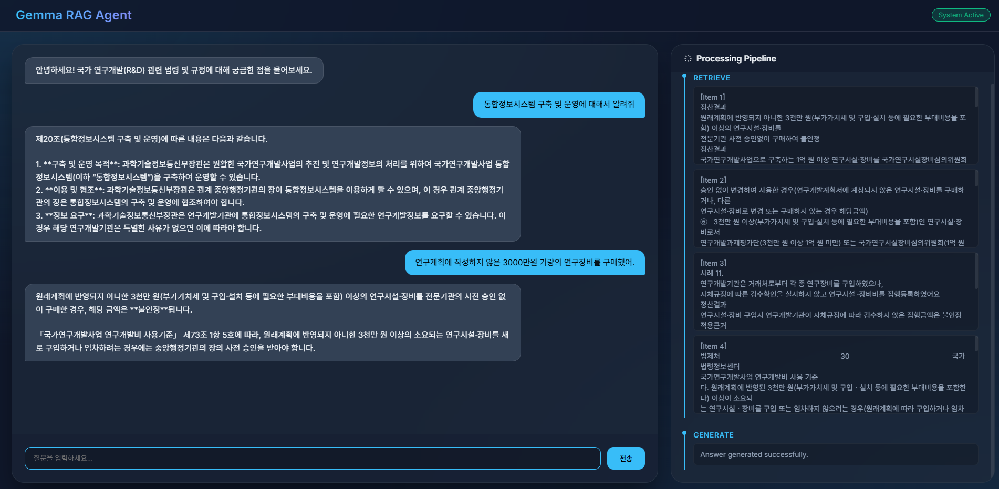

# Gemma RAG - 국가 R&D 규정 챗봇 & 디버깅 대시보드

이 프로젝트는 Ollama의 Gemma 모델과 LangChain, LangGraph, 그리고 Flask를 사용하여 국가 연구개발(R&D) 관련 법령 및 규정에 답변하는 프리미엄 RAG(Retrieval-Augmented Generation) 시스템입니다.

## 📸 실행 화면
| 메인 및 디버깅 대시보드 | 초기화 과정 시각화 |
|:---:|:---:|
|  |  |

## 🌟 주요 기능
- **웹 기반 챗봇 인터페이스**: 현대적이고 직관적인 채팅 UI를 통해 질의응답을 수행합니다.
- **실시간 디버깅 대시보드**:
  - **Step 1 (Loading)**: 로드된 원본 문서 및 메타데이터 시각화.
  - **Step 2 (Chunking)**: 분할된 텍스트 청크 데이터 확인.
  - **Step 3 (Embedding)**: 벡터화된 수치 데이터(차원 및 값) 확인.
- **로컬 LLM 및 임베딩**: 
  - LLM: Ollama (`gemma4:26b`) 활용.
  - 임베딩: 한국어 최적화 모델 (`jhgan/ko-sroberta-multitask`) 활용.
- **LangGraph 워크플로우**: 검색(Retrieve) 및 생성(Generate) 단계를 투명하게 관리.

## 🛠️ 필수 준비물
1. **Ollama 설치**: [ollama.com](https://ollama.com/)
2. **LLM 모델 다운로드**: 
   ```bash
   ollama pull gemma4:26b
   ```
   *(참고: 모델명은 `app.py`에서 수정 가능합니다.)*

## 🚀 설치 및 실행 방법

### 1. 환경 구성 및 패키지 설치
```bash
conda activate solo  # 또는 사용 중인 가상환경
pip install -r requirements.txt
pip install flask flask-cors sentence-transformers langchain-chroma
```

### 2. 웹 서버 실행
```bash
python app.py
```
실행 후 브라우저에서 `http://localhost:5000` 접속

## ⚠️ 사용 시 주의사항 (중요)

### 1. Ollama 연결 설정 (WSL 사용 시)
- **IP 주소**: 현재 `app.py`의 `OLLAMA_BASE_URL`은 WSL 환경에 최적화된 `172.27.48.1`로 설정되어 있습니다. 
- **일반 환경**: 만약 Windows/Linux 로컬에서 직접 실행한다면 `http://localhost:11434`로 수정이 필요합니다.
- **Ollama 환경 변수**: 호스트(Windows)의 Ollama가 외부 접속을 허용하도록 설정되어야 합니다. (Windows 시스템 환경 변수 `OLLAMA_HOST`를 `0.0.0.0`으로 설정 권장)

### 2. 임베딩 모델
- 본 프로젝트는 한국어 검색 성능 향상을 위해 HuggingFace의 전용 모델을 사용합니다. 최초 실행 시 모델 다운로드(약 400MB) 시간이 소요됩니다.

### 3. 데이터 보안
- 프로젝트에 포함된 PDF 파일이 외부 공개 금지 문서인 경우 GitHub 등 공용 저장소 업로드 시 주의하십시오. (본 샘플의 법령 데이터는 공개 자료입니다.)
- 프로젝트 내 포함된 IP 주소는 **사설 IP**이므로 공개되어도 보안상 문제가 되지 않습니다.

## 📁 프로젝트 구조
- `app.py`: Flask 웹 백엔드 및 RAG 핵심 로직.
- `templates/index.html`: 챗봇 UI 및 디버깅 대시보드 프론트엔드.
- `gemma_rag.py`: 터미널 기반 실행 스크립트.
- `chroma_db/`: 벡터 데이터베이스 저장 폴더.
- `*.pdf`: 학습용 국가 R&D 관련 문서.